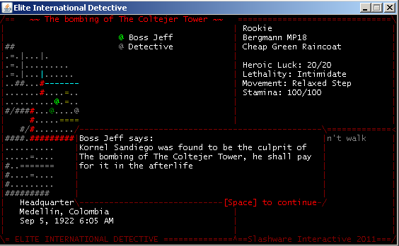
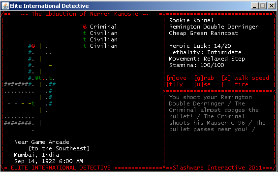

In Elite International Detective, you are an agent for the InterSleuth Cover Detective Network,
criminals all around the world strike against the civilian population... bombings, murderers and
kidnappings are daily news.

When lawful ways don't suffice, governments turn into our agency to bring an effective solution.

Travel all around the world pursuing international criminals, bring the wrath of justice over them!

# Development

Requires `serf-engine` and `libjcsi` as dependencies. Future gradle support is planned.

# Packaging

Export your jar into `distro` including the compiled contents of `src`. Make sure to use `META-INF/MANIFEST.MF`.
